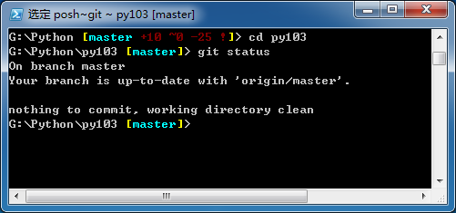

# Git/Github

------
## 什么是版本管理？为什么需要版本管理？

软件需要不断更新功能、修改Bug，所以版本会不断升级，功能会不断扩展。

软件的迭代有一个过程，不断增加的功能就像大树会不断长出新的枝干一样。在实际的工作中经常要进行多个版本中的切换，这就需要版本管理。

## 什么是Git？

- 一个分布式版本管理系统
- 命令行的界面
- 功能强大，操作简便



## 什么是Github？

Github就是一个面向开源及私有软件项目的托管平台，它只支持Git作为唯一的版本库格式进行托管。

为方便记忆，大家可以将Github理解为“码云”，代码的云托管服务器。它只能使用Git进行操作。


-----

## Git现场使用示范

场景：模拟两个人（两台手提电脑）同时编辑文件，Git是怎样处理文件的差异的？

1. 页面

## Github的特点

- 目前开源项目的托管平台
- 从项目的最开始，**所有的文件变动细节**都会进行记录
- 强大的分支管理和版本管理功能
- 操作便利

## 其他

- 可以使用Gitbook与Github同步进行电子书的编写
- 使用Github搭建自己的博客

-----


# Markdown
------

## 什么是Markdown？

Markdown是一套标签规则，用最简洁和少量的标签，达到日常编辑和排版的需要。

## Markdown示例

------

示例开始

# 这是1号标题

## 这是2号标题

### 这是3号标题

#### 这是4号标题

##### 这是5号标题

###### 这是6号标题

这是正文

- 无序列表1
- 无序列表2
- 无序列表3

------

1. 有序列表1
2. 有序列表2
3. 有序列表3

------

- [ ] 未完成事项1
- [ ] 未完成事项2
- [x] 已完成事项1
- [x] 已完成事项2

**这是黑体（B）**

*这是斜体（I）*

这是链接：[百度首页](http://www.baidu.com)

>这是引用
>
>《阳志平：开智部落三十天》
>
>专注「时间源头」：学海并非无涯，一个时代的卓越知识点是有限的，领域内的核心知识是有限集合而非无限集合。关注一手信息、经典神作，让你始终走在前沿；
>
>关注「内在动机」：就像在玩一个天平游戏，你以为，满足基本温饱，再去追求兴趣，成功会自然而来。一旦你**惯用外在奖赏而非兴趣、好奇心奖励自己；那时，你已经买不起兴趣、好奇心了。
>
>坚持「输出是更好的输入」：不要将自己当作学生。当成学生，你总有借口消化不了老师所授的知识。当老师，即使在头脑中想象教别人，也能提高学习效率。

------

    这是代码框
    print ("Hello World!")
    print ("Hello Again")
    print ("I like typing this.")
    print ("This is fun.")

或者是这样用：切换程序可以按下`Alt+Tab`

这是表格

| 标题1      |      标题2 |   标题3   |
| :--------   | --------:|   :------:   |
| 内容1      |     内容2 |   内容3   |

插入图片:


示例结束

----------

## 为什么使用Markdown？

- 专注你的文字内容而不是排版样式
- 轻松的导出 HTML、PDF格式
- 纯文本内容，兼容所有的文本编辑器与字处理软件
- 可读，直观，非常适合写作

## HTML

- HTML也是标签语言，就是我们目前打开浏览器看到的页面

- 将上面的示例显示转为HTML源码，将会看到下面的内容：

```
    <p>示例开始</p>
    <h1 id="-1-">这是1号标题</h1>
    <h2 id="-2-">这是2号标题</h2>
    <h3 id="-3-">这是3号标题</h3>
    <h4 id="-4-">这是4号标题</h4>
    <h5 id="-5-">这是5号标题</h5>
    <h6 id="-6-">这是6号标题</h6>
    <p>这是正文</p>
    <ul>
    <li><p>无序列表1</p>
    </li><li><p>无序列表2</p>
    </li><li><p>无序列表3</p>
    </li></ul>
    <ol>
    <li>有序列表1</li><li>有序列表2</li><li>有序列表3</li></ol>
    <p><strong>这是黑体（B）</strong></p>
    <p><em>这是斜体（I）</em></p>
    <ul>
    <li class="task-list-item"><input type="checkbox" class="task-list-item-checkbox" disabled> 未完成事项1</li><li class="task-list-item"><input type="checkbox" class="task-list-item-checkbox" disabled> 未完成事项2</li><li class="task-list-item"><input type="checkbox" class="task-list-item-checkbox" checked disabled> 已完成事项1</li><li class="task-list-item"><input type="checkbox" class="task-list-item-checkbox" checked disabled> 已完成事项2</li></ul>
    <p>这是链接：<a href="http://www.baidu.com">百度首页</a></p>
    <blockquote>
    <p>这是引用</p>
    <p>《阳志平：开智部落三十天》</p>
    <p>专注「时间源头」：学海并非无涯，一个时代的卓越知识点是有限的，领域内的核心知识是有限集合而非无限集合。关注一手信息、经典神作，让你始终走在前沿；</p>
    <p>关注「内在动机」：就像在玩一个天平游戏，你以为，满足基本温饱，再去追求兴趣，成功会自然而来。一旦你**惯用外在奖赏而非兴趣、好奇心奖励自己；那时，你已经买不起兴趣、好奇心了。</p>
    <p>坚持「输出是更好的输入」：不要将自己当作学生。当成学生，你总有借口消化不了老师所授的知识。当老师，即使在头脑中想象教别人，也能提高学习效率。</p>
    </blockquote>
    <hr>
    <pre><code>这是代码框
    print (&quot;Hello World!&quot;)
    print (&quot;Hello Again&quot;)
    print (&quot;I like typing this.&quot;)
    print (&quot;This is fun.&quot;)
    </code></pre><p>或者是这样用：切换程序可以按下<code>Alt+Tab</code></p>
    <p>这是表格</p>
    <table>
    <thead>
    <tr>
    <th style="text-align:left">Col1</th>
    <th style="text-align:right">Col2</th>
    <th style="text-align:center">Col3</th>
    </tr>
    </thead>
    <tbody>
    <tr>
    <td style="text-align:left">field1</td>
    <td style="text-align:right">field2</td>
    <td style="text-align:center">field3</td>
    </tr>
    </tbody>
    </table>
    <p>示例结束</p>
```

HTML标签特点：每个标签都有开头和结尾，如：

`<p><strong>这是黑体（B）</strong></p>`

这里有两个标签：`p`和`strong`，`<p>`表示开始，`</p>`表示结束，标签中间的部分表示需要渲染的部分，`p`表示是段落，在页面上表示为空一行，`strong`是黑体，所以浏览器获得HTML页面后，将中间的字体显示为黑体。

## Markdown编辑器介绍

我这里介绍一下Markdown的编辑器：

- 本地编辑器：

  - 记事本/Notepad++
  - Markdownpad
  - 印象笔记与马克飞象的搭配
  - Atom（有Windows与Mac版本）

- 在线编辑：

  - [Github](http://www.github.com)
  - [简书](http://www.jianshu.com/)
  - [作业部落（Cmd markdown）](https://www.zybuluo.com)
  - 有道云笔记
  - Farbox


# 现场Q&A

# 总结

- Github是开源项目的托管平台，只能使用Git进行版本管理
- Github可以进行项目管理使用
- Markdown是一套轻量级的标签，少许几个标签即可解决日常绝大部分的版本需求，写作时专注于内容即可
- Markdown有很多编辑器选择，选择一款自己喜欢的，更能增加写作兴趣